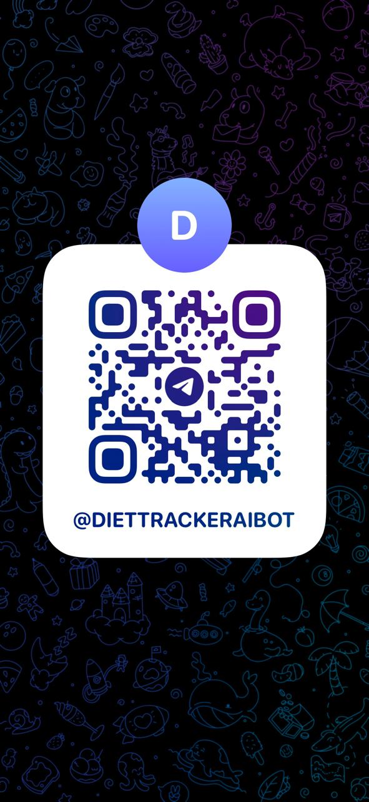

# Telegram AI CalTracker Bot

AI-powered Telegram calorie and nutrition tracker running on Cloudflare Workers. The bot extracts meal details with Gemini, stores logs in PostgreSQL, and gives daily summaries.

## What It Does

- Onboards users with name, timezone, and calorie goal
- Logs meals from free-text input using AI extraction
- Supports guided logging with `/log` and review buttons
- Saves detailed nutrient fields for each food item
- Shows grouped daily totals with `/today`

## Bot Access

Use either option below:

1. Open bot link: `https://t.me/DIETTRACKERAIBOT`
2. Scan QR code:



Place your QR image at `docs/images/telegram-bot-qr.png` so it renders on GitHub.

## Commands

- `/start` - Start onboarding
- `/log` - Start guided logging (bot asks for meal text next)
- `/log <meal text>` - Quick log in one message
- `/today` - Show today's saved foods and totals

## Tech Stack

- Cloudflare Workers + Wrangler
- TypeScript
- PostgreSQL (`postgres` runtime client)
- Prisma schema and migrations
- Gemini API

## Project Structure

```text
src/
	data/db.ts
	handlers/telegram-handler.ts
	services/ai.ts
	services/telegram.ts
	types/index.ts
	worker.ts
docs/
	backend-architecture-v2.md
```

## Prerequisites

- Node.js 20+
- npm
- Cloudflare account
- PostgreSQL database
- Telegram bot token

## Setup

```bash
npm install
```

Set Worker secrets:

```bash
wrangler secret put DATABASE_URL
wrangler secret put TELEGRAM_BOT_TOKEN
wrangler secret put TELEGRAM_WEBHOOK_SECRET
```

`GEMINI_MODEL` is configured via `wrangler.toml`.
Gemini API keys are loaded from DB table `gemini_keys`.

## Local Development

```bash
npm run cf:login
npm run cf:whoami
npm run cf:dev
```

## Deploy

```bash
npm run cf:deploy
```

## Endpoints

- `GET /health` - Health check
- `POST /telegram-webhook` - Telegram updates

## Database and Prisma

```bash
npm run prisma:validate
npm run prisma:generate
npm run prisma:push
```

## Type Check

```bash
npm run typecheck
```
